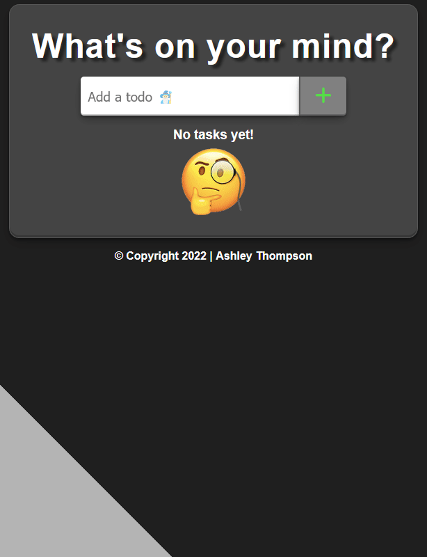

## Basic Todo App

This application was built in React and serves to manage todo's, with full CRUD functionality. Todos are saved in localstorage.
- [Deployed Heroku App](https://todo-app-at2022.herokuapp.com/)

## Future Features

- Back-end API integration for retrieving todos with user authentication
- Note component for each todo for better flexibility in jotting down ideas 

## Dependencies

- Nodejs v16.14.2
- Node Package Manager (NPM)
